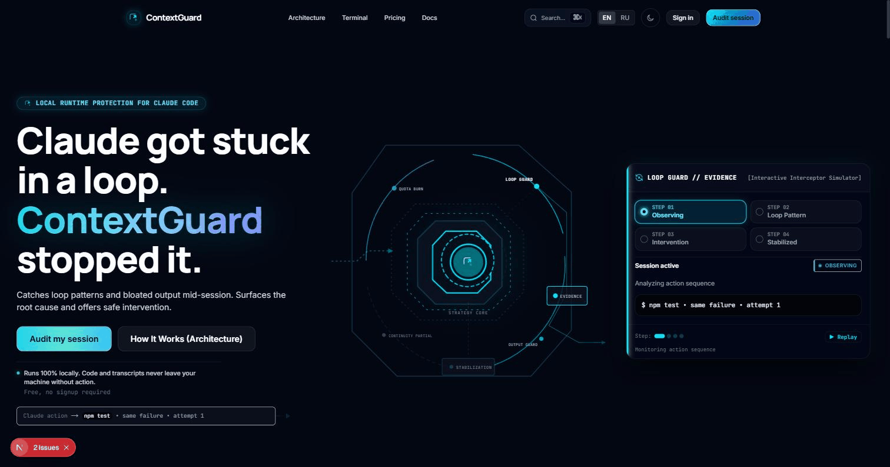

<div align="center">

# ContextGuard

**Local-first Runtime Guard & Efficiency Layer for Claude Code**
*Catches no-progress loops mid-session, preserves critical context across `/compact`, and shows exactly where your Claude Code tokens go.*

[](https://github.com/ChevvyOkK/contextguard/actions/workflows/ci.yml)
[](https://github.com/ChevvyOkK/contextguard/releases/latest)
[](#-license)
[](#)
[](https://github.com/ChevvyOkK/contextguard/stargazers)

[Quick Start](#-quick-start) · [How It Works](#-how-it-works) · [Detectors](#-the-six-detectors) · [Pro & Web Dashboard](#-pro--web-dashboard) · [Website](https://contextguard.tech)

</div>

<br>

<div align="center">
  
  <sub>The live <a href="https://contextguard.tech">web dashboard</a> demo — same detection logic the CLI and runtime plugin run locally.</sub>
</div>

<br>

> [!IMPORTANT]
> **100% Local-First by Construction.** ContextGuard runs alongside Claude Code on your own machine.
> - **CLI Analytics**: Reads session transcripts from `~/.claude/projects/` strictly offline.
> - **Runtime Plugin**: Inspects local hook events to halt loops and restore forgotten constraints.
> - **Zero Code Egress**: Source code, raw prompts, and conversations **never leave your machine**. Zero network calls unless you explicitly pass `--push`.

<br>

## 🛡️ How It Works

ContextGuard operates as an active safety and continuity layer hooked directly into the Claude Code lifecycle:

```
┌─────────────────────────────────────────────────────────────────────────┐
│ 1. OBSERVE (Claude Code Lifecycle Hooks)                                │
│    • Tool calls, bash execution outputs, test runner outcomes           │
│    • /compact trigger events and local token/cost burn patterns        │
├─────────────────────────────────────────────────────────────────────────┤
│ 2. DETECT (Zero-Lag Local Heuristics)                                  │
│    • Semantic No-Progress: same root test failure survived 3+ edits     │
│    • Continuity Risk: critical CLAUDE.md constraints need re-injection  │
│    • Abnormal Burn Rate: local sessions burning faster than history     │
├─────────────────────────────────────────────────────────────────────────┤
│ 3. INTERVENE (Targeted Safeguards)                                      │
│    • Structured Force Rethink protocol injected directly into context   │
│    • Opt-in hard-stop for repeated identical calls                      │
│    • Automatic bash/grep output truncation with signal preservation     │
├─────────────────────────────────────────────────────────────────────────┤
│ 4. PRESERVE (Zero Data Loss)                                            │
│    • Lossless Vault: 100% of raw output archived locally to disk        │
│    • Continuity Guard: auto-restores critical architectural rules       │
└─────────────────────────────────────────────────────────────────────────┘
```

<br>

## 📺 Live Demonstration

```text
$ contextguard --days 7

ContextGuard — Claude Code Session & Quota Audit

Sessions analyzed: 16
Tokens — input: 1,180,302 | cache-write: 839,516 | cache-read: 14,812,004 | output: 401,552
Estimated cost: $21.92 | Cache reuse efficiency: 88%

Observed Runtime Inefficiencies:
  [!] 3 No-Progress loops detected (same test failure across multiple edits)
  [!] 18 Repeated unchanged file reads (wasting ~34k cache tokens)
  [!] 2 Context amnesia events after /compact (critical rules dropped)
  [!] CLAUDE.md is 412 lines (~3,900 tokens) — re-read on every turn

Cost & Quota Optimization Engine:

  Saved ≈ $4.18
  Session 4f9a2b7c: Cache invalidated on turns 2+ (61% cache-write penalty).
  Fix: Keep stable content (rules, schemas) at prompt start, changing code at end.

  Saved ≈ $1.32
  src/handlers/payment.rs was re-read 5 times in session 2c8e0d15 without edits.
  Fix: Cache reference or Grep specific functions instead of re-reading full file.

  Saved ≈ $9.60
  CLAUDE.md is 412 lines and gets re-sent every turn.
  Fix: Run `contextguard lint --fix` to prune ~200 lines of boilerplate.
```

> [!TIP]
> Every diagnostic provides three clear lines: **Impact, Root Cause, and Fix.** No complex dashboards required — you get the exact terminal diff to run.

<br>

## ⚡ Quick Start

```bash
# 1. Install ContextGuard CLI (prebuilt binary — macOS, Linux)
curl -sSf https://contextguard.tech/install.sh | sh

# 1. Windows (PowerShell) — same install, no Git Bash/WSL needed
irm https://contextguard.tech/install.ps1 | iex

# 2. Add the live Runtime Guard to Claude Code
/plugin marketplace add ChevvyOkK/contextguard-plugin

# 3. Run a local audit across your sessions
contextguard --days 7

# 4. Lint and auto-prune your CLAUDE.md
contextguard lint CLAUDE.md --fix

# 5. Output in Russian
contextguard --lang ru
```

<br>

## 🧠 The Six Detectors

Deterministic analyzers inspect usage patterns and protect your workflow — no LLM calls, no telemetry, just local heuristics:

| Detector | What it catches | How it intervenes |
|---|---|---|
| **No-Progress Breaker** | The same test failure survives multiple real edits | Injects **Structured Force Rethink** protocol |
| **Continuity Guard** | Important CLAUDE.md constraints should survive `/compact` | Captures and re-injects rule-like constraints |
| **Cache Churn Watcher** | Cache writes exceed cache reads on turns 2+ | Pinpoints cache-busting prompt shifts |
| **CLAUDE.md Amortizer** | `CLAUDE.md` exceeds recommended 200 lines | Identifies boilerplate lines and autofixes |
| **Re-Read Watcher** | Unchanged file read 3+ times in one session | Suggests targeted grepping or caching |
| **Burn-Rate Watcher** | Local session cost is an outlier versus enough prior sessions | Flags the anomalous session with the comparison used |

<br>

## 🗄️ Smart Output Guard & Lossless Vault

When commands produce massive output (e.g. `npm test`, `pytest -vv`, `cargo build`), ContextGuard:
1. **Truncates active context** to the head, tail, and key stacktrace/error lines (saving up to 85% token bloat).
2. **Archives 100% raw output** to `~/.claude/contextguard/vault/CG-XXXXX.log`.
3. **Tags the output** with a reference ID and writes a local evidence event with exact size impact.

```text
... [ContextGuard Lossless Vault: 450 lines archived locally as ref: CG-84A21 — full output preserved] ...
[ContextGuard: key error lines from omitted block]
  FAILED tests/test_payment.py::test_checkout - AssertionError: 400 != 200
```

```bash
# Recall the full raw log anytime
cat ~/.claude/contextguard/vault/CG-84A21.log
```

<br>

## 🩺 `contextguard lint` — CLAUDE.md Optimizer

`CLAUDE.md` is re-sent on **every single request** in Claude Code. Unnecessary instructions act as a permanent tax on your quota.

```bash
$ contextguard lint CLAUDE.md --fix

CLAUDE.md diagnostics — 412 lines, ~3,900 tokens

  [boilerplate]   L88   Always write clean code. -> restates model default
  [stale path]    L214  See `src/legacy-v1.rs`   -> no session touched this path
  [duplicate]     L302  Do not edit Cargo.lock   -> identical to L14

Done — 2 lines removed automatically with --fix (~18 tokens/turn).
```

<br>

## 🤖 CI/CD Integration

Check PR changes to `CLAUDE.md` automatically in GitHub Actions:

```yaml
# .github/workflows/claude-md-lint.yml
name: CLAUDE.md Cost & Bloat Check
on: pull_request

permissions:
  pull-requests: write

jobs:
  lint:
    runs-on: ubuntu-latest
    steps:
      - uses: actions/checkout@v4
        with:
          fetch-depth: 0
      - uses: ChevvyOkK/contextguard@v0.6.0
```

<br>

## ⚙️ CLI Command Reference

| Command | Purpose |
|---|---|
| `contextguard` | Full local audit across all Claude Code sessions |
| `contextguard --days 7` | Audit the last 7 days of activity |
| `contextguard lint [PATH] [--fix]` | Lint and prune `CLAUDE.md` bloat |
| `contextguard context` | Breakdown of tokens inside the active 200k window |
| `contextguard savings` | Report of tokens and quota saved by the plugin |
| `contextguard evidence [--limit 20]` | List recent local guard evidence events |
| `contextguard recall <event-or-vault-id>` | Print a full vaulted output or evidence event by ID |
| `contextguard budget --max <USD>` | Exit 1 if local spending exceeds budget limit |
| `contextguard git-cost` | Attribute session token costs to git branches and PRs |

<br>

## 🚀 Pro & Web Dashboard

Everything above runs fully offline, for free, forever. **ContextGuard Pro** adds an opt-in layer on top:

- **Web Dashboard** — team-visible view of aggregate spend, cache efficiency, and CLAUDE.md health across projects.
- **Telegram Remote Control** — pair a session to a Telegram chat and keep an eye on a long-running Claude Code task from your phone.
- **Budget Alerts** — get notified before a session runs away with your quota.

No code, prompts, or transcripts are ever uploaded as part of Pro — only the aggregate numbers you can already see in `contextguard savings`.

**[→ See plans on the website](https://contextguard.tech/#pricing)**

<br>

## 🔒 Privacy Architecture

- **Zero telemetry by default**: No analytics, no tracking, no phone-home.
- **Zero code egress**: Prompts and source files remain strictly on your local disk.
- **Optional team sync**: Only activated if you explicitly run `contextguard --push`, sending daily aggregate numbers (token counts and session volume only, never code or conversation text).

<br>

## 📄 License

Releases through v0.6.0 are dual-licensed under either the [MIT license](LICENSE-MIT) or [Apache License, Version 2.0](LICENSE-APACHE), at your option — those terms stand and aren't retroactively revoked.

Development of the CLI has since moved to a private repository; this repo is now the public distribution point (releases, install scripts, GitHub Action, npm wrapper) and product homepage.
